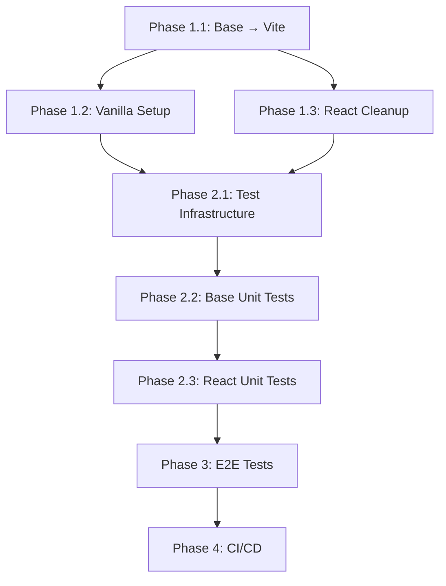

# HTML Flip Book - Modernization Plan

> **Created:** January 20, 2026 **Status:** In Progress

## Executive Summary

This document outlines the modernization strategy for the `html-flip-book`
repository, a 2-year-old project that provides a flipbook component for HTML
with React and Vanilla JS wrappers. The main goals are:

1. **Unify build tooling** - Migrate everything to Vite for consistency
2. **Implement comprehensive testing** - Vitest for unit tests, Playwright for
   E2E
3. **Achieve 100% code coverage** - Merged unit + E2E coverage
4. **Update all dependencies** - Bring everything to latest versions
5. **Enable future development** - Prepare for feature additions and refactoring

---

## Current State Analysis

### Project Structure (Unified)

```
html-flip-book/
├── vite.config.ts       # Root build config (builds base, react, etc.)
├── vitest.config.ts     # Root test config
├── playwright.config.ts # E2E test config
├── tsconfig.json        # Root TypeScript config
├── scripts/
│   └── merge-coverage.mts
├── base/                # Core flipbook logic
│   ├── package.json     # For npm publishing (base deps only)
│   ├── tsconfig.json    # Extends root
│   └── src/
├── react/               # React wrapper
│   ├── package.json     # For npm publishing (React deps only)
│   ├── tsconfig.json    # Extends root
│   └── src/
├── react/example/       # React demo app
├── vanilla/             # Vanilla JS demo
├── e2e/                 # Playwright E2E tests
└── .coverage/           # Coverage output
    ├── unit/
    ├── e2e/
    └── merged/
```

### Build System Status

| Module      | Current Build Tool  | Target | Status      |
| ----------- | ------------------- | ------ | ----------- |
| **root**    | Vite (multi-target) | ✅     | In Progress |
| **base**    | Built from root     | ✅     | In Progress |
| **react**   | Built from root     | ✅     | In Progress |
| **vanilla** | Vite dev server     | ❌     | Not started |

### Test Coverage Status

| Test Type           | Framework                 | Status            | Coverage |
| ------------------- | ------------------------- | ----------------- | -------- |
| **Unit Tests**      | Vitest (to be set up)     | ❌ No tests exist | 0%       |
| **E2E Tests**       | Playwright (to be set up) | ❌ Not set up     | 0%       |
| **Merged Coverage** | monocart-reporter         | ❌ Not set up     | 0%       |

### Current Dependencies Analysis

#### Root `package.json`

- ✅ Node 22+ required (modern)
- ⚠️ ESLint 8.x (should upgrade to 9.x flat config fully)
- ⚠️ Webpack dependencies at root level (should be removed after migration)
- ✅ Jest & ts-jest configured (but no tests)
- ⚠️ Mixed concerns - root has webpack loaders that belong in base

#### Base Module (`base/package.json`)

- ⚠️ Uses Webpack with complex ts-node loader setup
- ✅ ES Modules enabled (`"type": "module"`)
- ✅ Dependencies: hammerjs, throttle-debounce, type-fest

#### React Module (`react/package.json`)

- ✅ Already using Vite 5.3.3
- ✅ Modern React 18.3
- ⚠️ Uses deprecated `@vitejs/plugin-react-refresh` (should use SWC only)
- ✅ Has vitest as devDependency (but unused)

### Source Code Analysis

#### Base Module - Files to Test

| File                   | LOC | Purpose                                  | Complexity |
| ---------------------- | --- | ---------------------------------------- | ---------- |
| `flipbook.ts`          | 381 | Main FlipBook class                      | High       |
| `leaf.ts`              | 174 | Page leaf handling, animations           | High       |
| `size.ts`              | 17  | Size utility with aspect ratio fitting   | Low        |
| `aspect-ratio.ts`      | 14  | AspectRatio interface and implementation | Low        |
| `flip-direction.ts`    | 5   | FlipDirection enum                       | Trivial    |
| `page-semantics.ts`    | 5   | PageSemantics interface                  | Trivial    |
| `flip-book-options.ts` | 12  | Options interface                        | Trivial    |
| `flipbook.scss`        | 22  | Core styles                              | N/A        |
| `pages.scss`           | 19  | Page styles                              | N/A        |

#### React Module - Files to Test

| File           | LOC | Purpose                 | Complexity |
| -------------- | --- | ----------------------- | ---------- |
| `FlipBook.tsx` | 43  | React wrapper component | Medium     |

---

## Modernization Tasks

### Phase 1: Build System Unification (Vite Migration)

#### 1.1 Migrate to Single Root Vite Config

- [x] Create root `vite.config.ts` with multi-target build (base, react,
      vanilla)
- [x] Create root `vitest.config.ts` for unified testing
- [x] Create root `playwright.config.ts` for E2E testing
- [x] Update root `tsconfig.json` for unified project
- [x] Update `base/tsconfig.json` to extend root
- [x] Update `react/tsconfig.json` to extend root
- [x] Clean up `base/package.json` (keep only publishing deps)
- [x] Clean up `react/package.json` (keep only publishing deps)
- [x] Remove Webpack dependencies from root
- [x] Delete `base/webpack.config.ts`
- [x] Delete `react/vite.config.js`
- [x] Delete `jest.config.js`

#### 1.2 Set Up Vanilla Example with Vite

- [ ] Create `vanilla/package.json`
- [ ] Create proper `vanilla/src/main.ts` entry point
- [ ] Update `vanilla/index.html` for Vite

### Phase 2: Unit Testing (Vitest)

#### 2.1 Set Up Testing Infrastructure

- [x] Configure Vitest for base module with happy-dom
- [x] Configure code coverage with Istanbul
- [x] Set up coverage output to `.coverage/unit/`
- [ ] Add testing utilities (mocking HammerJS, RAF)

#### 2.2 Base Module Unit Tests (Target: 100%)

| Test File                | Tests for                           | Priority | Status        |
| ------------------------ | ----------------------------------- | -------- | ------------- |
| `aspect-ratio.test.ts`   | `AspectRatio`, `AspectRatioImpl`    | P1       | ✅ Done       |
| `size.test.ts`           | `Size` class                        | P1       | ✅ Done       |
| `flip-direction.test.ts` | `FlipDirection` enum                | P1       | ✅ Done       |
| `leaf.test.ts`           | `Leaf` class animations             | P1       | ✅ Done (91%) |
| `flipbook.test.ts`       | `FlipBook` class (DOM interactions) | P1       | ❌ TODO       |

**Test Categories:**

- [x] Unit tests for pure functions (Size, AspectRatio)
- [x] Unit tests for enums/interfaces (FlipDirection, PageSemantics)
- [x] Unit tests for Leaf class (animation logic, state management)
- [ ] Unit tests for FlipBook class (initialization, page management)
- [ ] DOM interaction tests (HammerJS events, touch handling)

#### 2.3 React Module Unit Tests

| Test File           | Tests for                        | Priority |
| ------------------- | -------------------------------- | -------- |
| `FlipBook.test.tsx` | React component rendering, props | P1       |

**Test Categories:**

- [ ] Component rendering tests
- [ ] Props handling tests
- [ ] useRef/useEffect hook behavior
- [ ] Integration with base FlipBook

### Phase 3: E2E Testing (Playwright)

#### 3.1 Set Up Playwright

- [x] Install Playwright and browsers
- [x] Create `playwright.config.ts`
- [x] Configure monocart-reporter for coverage
- [x] Set up coverage output to `.coverage/e2e/`
- [x] Configure test servers for examples
- [ ] Set up CI/CD integration (in progress)

#### 3.2 E2E Test Scenarios

| Test Suite              | Scenarios                      | Priority | Status     |
| ----------------------- | ------------------------------ | -------- | ---------- |
| `navigation.spec.ts`    | Page flipping forward/backward | P1       | ✅ Created |
| `touch.spec.ts`         | Touch/swipe gestures           | P1       | ❌ TODO    |
| `mouse.spec.ts`         | Mouse drag interactions        | P1       | ❌ TODO    |
| `direction.spec.ts`     | RTL/LTR support                | P2       | ❌ TODO    |
| `responsive.spec.ts`    | Different viewport sizes       | P2       | ❌ TODO    |
| `accessibility.spec.ts` | Keyboard navigation, ARIA      | P3       | ❌ TODO    |

**E2E Test Coverage Goals:**

- [ ] All user interaction paths
- [ ] Both React and Vanilla examples
- [ ] Multiple viewport sizes
- [ ] RTL and LTR directions
- [ ] Visual regression testing (optional)

### Phase 4: Coverage Merging & CI/CD

#### 4.1 Coverage Merge Strategy (from bible-on-site)

- [x] Create `.coverage/` directory structure
- [x] Configure unit coverage output to `.coverage/unit/lcov.info`
- [x] Configure E2E coverage output to `.coverage/e2e/lcov.info`
- [x] Create `scripts/merge-coverage.mts` to merge LCOV files
- [ ] Normalize anonymous function names before merge (optional)
- [x] Output merged coverage to `.coverage/merged/lcov.info`

#### 4.2 GitHub Actions Updates

- [x] Update build workflow for Vite
- [x] Add unit test job with coverage
- [x] Add E2E test job with coverage
- [x] Add coverage merge step
- [x] Add coverage badge generation
- [ ] Set up coverage thresholds (fail if < 100%)

#### 4.3 Quality Gates

- [ ] Pre-commit hooks with Husky
- [ ] Lint-staged for formatting
- [ ] Require 100% coverage for merge

---

## Implementation Order



### Recommended Execution Order

1. **Week 1**: Phase 1 (Build System)
   - Migrate base to Vite
   - Set up vanilla example
   - Clean up React module
   - Update root configs

2. **Week 2**: Phase 2 (Unit Tests)
   - Set up Jest/Vitest infrastructure
   - Write tests for simple modules (Size, AspectRatio, FlipDirection)
   - Write tests for Leaf class
   - Write tests for FlipBook class

3. **Week 3**: Phase 3 (E2E Tests)
   - Set up Playwright
   - Write core navigation tests
   - Write interaction tests
   - Write direction tests

4. **Week 4**: Phase 4 (CI/CD)
   - Update GitHub Actions
   - Add quality gates
   - Final coverage verification

---

## Technical Decisions

### Why Vite Over Webpack?

1. **Faster development** - Native ES modules, no bundling in dev
2. **Simpler configuration** - Less boilerplate than Webpack
3. **Better DX** - Hot Module Replacement is instant
4. **Library mode** - First-class support for building libraries
5. **Consistency** - React module already uses Vite

### Why Vitest Over Jest?

1. **Native Vite integration** - Same config, same transforms
2. **Faster** - Uses Vite's dev server for instant HMR
3. **ESM first** - No issues with ES Modules
4. **Compatible API** - Same expect/describe/it syntax as Jest
5. **Already in react/** - vitest is already a devDependency

### Why Playwright for E2E?

1. **Modern** - Built by Microsoft, actively maintained
2. **Cross-browser** - Chromium, Firefox, WebKit
3. **Auto-waiting** - Reduces flaky tests
4. **Trace viewer** - Excellent debugging experience
5. **TypeScript** - First-class TypeScript support

### Coverage Merge Strategy

Based on [bible-on-site](https://github.com/bible-on-site/bible-on-site)
approach:

1. **Unit tests** output LCOV to `.coverage/unit/lcov.info`
2. **E2E tests** output LCOV to `.coverage/e2e/lcov.info` via monocart-reporter
3. **Normalize** anonymous function names (e.g., `anonymous_L42`)
4. **Merge** using lcov-cli or simple concatenation
5. **Output** to `.coverage/merged/lcov.info`

---

## Risk Assessment

| Risk                               | Impact | Mitigation                   |
| ---------------------------------- | ------ | ---------------------------- |
| HammerJS mocking complexity        | Medium | Use real DOM with jsdom      |
| Animation timing in tests          | Medium | Mock requestAnimationFrame   |
| Touch events in E2E                | Low    | Playwright has touch support |
| Coverage for SCSS                  | Low    | Exclude from coverage        |
| Breaking changes in Vite migration | Medium | Incremental testing          |

---

## Files to Create/Modify

### New Files

```
base/vite.config.ts
base/vitest.config.ts
base/src/__tests__/aspect-ratio.test.ts
base/src/__tests__/size.test.ts
base/src/__tests__/flip-direction.test.ts
base/src/__tests__/leaf.test.ts
base/src/__tests__/flipbook.test.ts
react/src/__tests__/FlipBook.test.tsx
vanilla/package.json
vanilla/vite.config.ts
vanilla/src/main.ts
playwright.config.ts
e2e/navigation.spec.ts
e2e/touch.spec.ts
e2e/mouse.spec.ts
e2e/direction.spec.ts
scripts/merge-coverage.mts
.coverage/.gitkeep
```

### Files to Modify

```
package.json (root)
base/package.json
base/tsconfig.json
react/package.json
react/vite.config.js
.github/workflows/ci.yml
```

### Files to Delete

```
base/webpack.config.ts
jest.config.js
```

---

## Success Criteria

- [ ] All modules build with Vite
- [ ] `npm run build` succeeds for all modules
- [ ] Unit test coverage ≥ 100% (statements, branches, functions, lines)
- [ ] E2E tests pass for all critical user flows
- [ ] CI/CD pipeline runs all tests
- [ ] No Webpack dependencies remain
- [ ] Development server starts in < 1 second

---

## What's Already Done ✅

The project already has several modern practices in place:

### Infrastructure

- ✅ **Node 22+** - Modern Node.js requirement
- ✅ **ES Modules** - All packages use `"type": "module"`
- ✅ **TypeScript 5.5** - Latest TypeScript with strict mode
- ✅ **GitHub Actions CI** - Build and deploy pipeline exists
- ✅ **Dependabot** - Automated dependency updates
- ✅ **Pre-commit hooks** - Pre-commit config with ESLint
- ✅ **ESLint + Prettier** - Code linting and formatting
- ✅ **Coverage badge** - Badge generation configured

### React Module

- ✅ **Vite 5.3** - Modern build tool
- ✅ **React 18.3** - Latest React
- ✅ **TypeScript declarations** - vite-plugin-dts configured
- ✅ **Example app** - Fully working React example

### CI/CD (`.github/workflows/ci.yml`)

- ✅ Build job with Node.js setup
- ✅ ESLint linting
- ✅ GitHub Pages deployment
- ⚠️ Tests commented out (awaiting test implementation)
- ⚠️ Format check commented out

---

## Appendix: Current Package Versions

### Root Dependencies (to update/remove)

| Package                 | Current | Action        |
| ----------------------- | ------- | ------------- |
| webpack                 | 5.92.1  | Remove        |
| webpack-cli             | 5.1.4   | Remove        |
| css-loader              | 7.1.2   | Remove        |
| style-loader            | 4.0.0   | Remove        |
| sass-loader             | 14.2.1  | Remove        |
| mini-css-extract-plugin | 2.9.0   | Remove        |
| ts-loader               | 9.5.1   | Remove        |
| eslint                  | 8.57.0  | Update to 9.x |

### Dependencies to Add

| Package                   | Purpose                          |
| ------------------------- | -------------------------------- |
| @playwright/test          | E2E testing                      |
| @testing-library/react    | React component testing          |
| vitest                    | Unit testing (move to root)      |
| @vitest/coverage-istanbul | Coverage collection              |
| vite                      | Base module build (move to root) |
| vite-plugin-dts           | TypeScript declarations          |
| monocart-reporter         | Playwright coverage reporting    |
| happy-dom                 | Fast DOM for Vitest              |

### Dependencies to Update (run `npm run update`)

All dependencies should be updated to latest versions using npm-check-updates.

---

## Coverage Directory Structure

```
.coverage/
├── unit/
│   └── lcov.info          # Vitest unit test coverage
├── e2e/
│   └── lcov.info          # Playwright E2E coverage
└── merged/
    └── lcov.info          # Combined coverage for badge/upload
```

---

## Next Steps

1. Review and approve this plan
2. Create feature branch: `feat/modernization`
3. Begin Phase 1.1: Migrate base module to Vite
4. Track progress in this document

---

_Last Updated: January 20, 2026_
